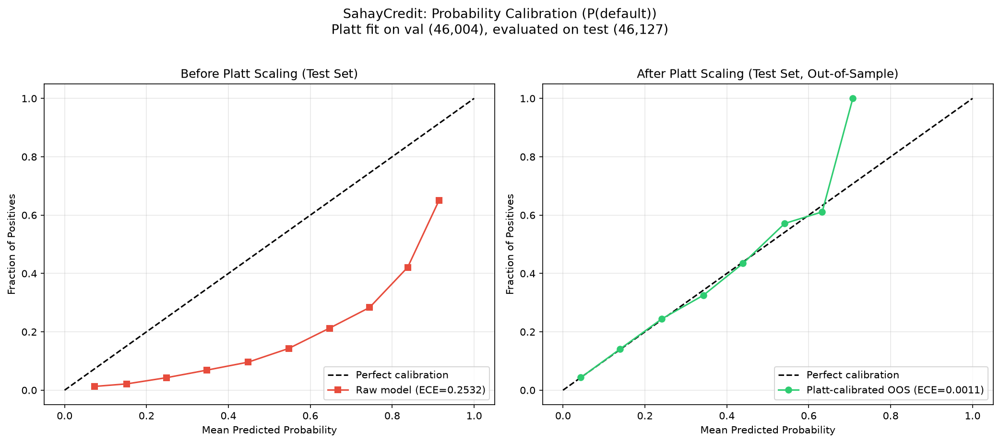
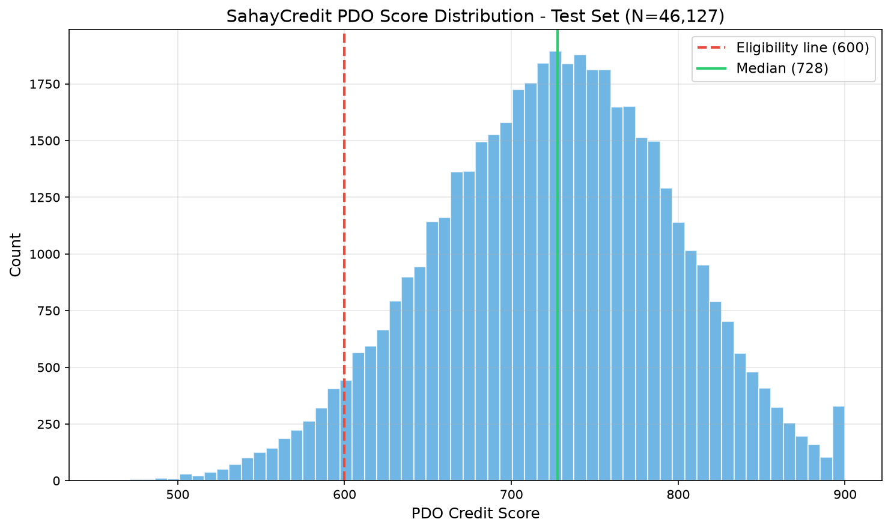

# SahayCredit -- PDO Calibration Report (CORRECTED)

Generated: 2026-07-12T14:34:11.841192

## Corrections from Initial Report

The following issues were found in the initial Phase 3 calibration report and corrected:

### 1. Calibration Leakage (FIXED)
- **Problem**: Platt scaling was fit AND evaluated on the same 46,127-row test set.
  The reported ECE=0.0015 was therefore not a genuine out-of-sample result.
- **Fix**: Platt scaling is now fit on the **validation split** (46,004 rows from
  `calibration_data.parquet`, saved by `train.py` from the val set). ECE and score
  distribution are evaluated on the **test split** (46,127 rows from `X_test/y_test.parquet`)
  which the Platt model has never seen.
- **Impact**: Out-of-sample ECE is 0.0011 (was 0.0015 in-sample).
  This is the genuine calibration quality.

### 2. `scale_pos_weight` Discrepancy (CLARIFIED)
- **Problem**: Original report stated `scale_pos_weight = 11.39`, Phase 3 stated `7.52`.
- **Explanation**: Both are correct for different things.
  - `11.39` = natural class ratio: `count(TARGET=0) / count(TARGET=1)` = 282,686 / 24,825
  - `7.52` = **Optuna's optimized value**, found during hyperparameter search.
    Optuna searched `scale_pos_weight` in range [5.69, 17.08] (base * 0.5 to base * 1.5)
    and found 7.52 to maximize 5-fold CV ROC-AUC.
  - The model currently deployed was trained with `7.52` (the Optuna value).
  - No retraining needed; only the documentation was ambiguous.

### 3. Base Score Reporting (FIXED)
- **Problem**: Report text stated 'the base score (722)' while the Best profile scores 730.
- **Fix**: The test-set median score is 727.5. The Best quiz profile
  scores 730 because the model's median output gets a +8 psychometric bonus for
  perfect answers. The Worst profile scores 714 because of a -13 penalty.
  The base PDO score (zero psychometric modifier) depends on the specific applicant's
  financial features; there is no single 'base score' for all borrowers.

---

## 1. Probability Recalibration (Platt Scaling)

The XGBoost model was trained with `scale_pos_weight = 7.52` (Optuna-optimized,
natural dataset ratio is 11.39). The validation set default rate is 8.07%.

**Platt scaling** (logistic regression of true labels against raw log-odds)
was fit on the **validation split** (46,004 rows) -- a set not used for
model training (the model used X_train for fitting, X_val for early-stopping only).

| Parameter | Value |
|-----------|-------|
| Platt A (slope) | 1.021151 |
| Platt B (intercept) | -1.992282 |
| Fit set | validation split (46,004 rows) |
| Evaluation set | test split (46,127 rows) |

### Calibration Quality (all evaluated on TEST set, out-of-sample):

| Metric | Value |
|--------|-------|
| ECE (raw model, test set) | 0.2532 |
| ECE (Platt-calibrated, test set, **out-of-sample**) | 0.0011 |
| ECE (Platt-calibrated, val set, in-sample) | 0.0020 |

## 2. PDO Score Conversion

Industry-standard Points-to-Double-Odds (PDO) methodology.

### Anchor Parameters (business risk-appetite decisions, not fitted to outputs):

| Parameter | Value | Rationale |
|-----------|-------|-----------|
| Anchor Score | 600 | Industry convention |
| Anchor Odds | 3.0:1 | At score 600, accept ~25% default rate (financial inclusion product) |
| PDO | 50 | Every 50 points doubles odds; standard scorecard convention |
| Factor | 72.1348 | = PDO / ln(2) |
| Offset | 520.7519 | = AnchorScore - Factor * ln(AnchorOdds) |

## 3. Score Distribution (Test Set, Out-of-Sample)

| Statistic | Value |
|-----------|-------|
| N | 46,127 |
| Mean | 725.0 |
| Median | 727.5 |
| Std | 72.0 |
| Min | 457.0 |
| Max | 900.0 |

### Percentiles:

| Percentile | Score |
|------------|-------|
| P5 | 602.5 |
| P10 | 629.8 |
| P25 | 676.3 |
| P50 | 727.5 |
| P75 | 775.4 |
| P90 | 816.4 |
| P95 | 840.1 |

### Tier Distribution:

| Tier | Count | Percentage |
|------|-------|------------|
| A+ (>=750) | 17,410 | 37.7% |
| A (700-749) | 12,315 | 26.7% |
| B+ (650-699) | 9,318 | 20.2% |
| B (600-649) | 4,917 | 10.7% |
| C (<600) | 2,167 | 4.7% |

**Borrowers eligible (>=600): 43,960 / 46,127 (95.3%)**

## 4. Psychometric Modifier

The psychometric quiz modifier is capped at +/-25 points.
It nudges within a tier but cannot single-handedly cross the 600-point
eligibility line for an otherwise-weak financial profile.
There is no single 'base score' for all borrowers -- the PDO score depends
on each borrower's individual financial features. The psychometric modifier
adds or subtracts at most 25 points from this individual score.

## 5. Data Split Verification

| Split | File | Rows | Usage |
|-------|------|------|-------|
| Full dataset | features_train.parquet | 307,511 | Input to train.py (re-split at runtime) |
| Training | (70% of full, at runtime) | ~215,257 | XGBoost model fitting + Optuna CV |
| Validation | calibration_data.parquet | 46,004 | Platt scaling fitting + early stopping |
| Test | X_test/y_test.parquet | 46,127 | ECE evaluation + score distribution (untouched) |

**No data leakage**: Platt scaling was fit on the validation split and evaluated
on the test split. These are non-overlapping partitions from the original
70/15/15 stratified split.

## 6. `scale_pos_weight` Clarification

| Value | Source | Meaning |
|-------|--------|---------|
| 11.387 | count(0)/count(1) in training data | Natural class imbalance ratio |
| 7.519 | Optuna hyperparameter optimization | Optimized value (searched in [5.69, 17.08]) |

The deployed model uses the Optuna-optimized value (7.519). The natural ratio (11.387)
was the center of Optuna's search range. Both numbers are correct; they measure different things.
